# 줍깅 Joopgging - Backend 🏃‍♂️🏃‍♀️

줍깅 Link : https://joopgging.link

Frontend GitHub :

Project Joopggng Notion : 

### 🍃 프로젝트 소개 

------

프로젝트 소개 완벽한 **플로깅 파트너** 

원하는 지역에서 원하는 거리, 장소를 정하여 

같은 뜻을 가진 사람들과 함께 플로깅을 할 수 있는 맞춤형 서비스 "**줍깅**" !

줍깅을 통해 사람과 소통하고 지구에 생명을 불어넣는 **함께하는 세상**을 만들어가요 ! 

그리고 줍깅을 이용할 때마다 **줍깅러들을 축하해주는 뱃지**들도 만나보아요!  :)

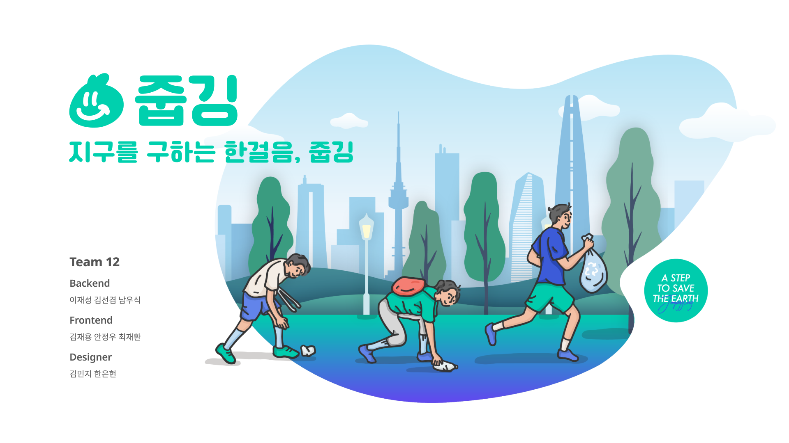

### 💡기획 배경

------

최근 몇년 새 MZ세대를 중심으로 운동과 환경을 함께 생각하는 **그리너리/에코 챌린지 및 활동이 활발**해졌습니다.더불어 생소했던 **플로깅**에 대한 인식 확산으로 단체/기업 등 홍보 차원의 플로깅 캠페인 역시 활성화 되고 있습니다. 

그러나 대부분 **홍보 목적이나 단발성 이벤트**에 그치고 있어 개인이 직접 모임을 만들어 활동하긴 어려웠고 이로 인해 플로깅이 활성화 되기엔 제약이 있다고 생각했습니다. 그리하여 기존의 한계를 극복하고 플로깅을 한층 더 활성화하기 위해 **플로깅 모집/소통이 가능한 플랫폼 개발 구상**을 하게 되었습니다. 

저희는 산발적으로 흩어져 있는 플로깅 참여자를 한 곳에 모집해주고 소통할 수 있는 커뮤니티를 지원하며, 모임 참여자, 주최자 구분없이 다양하고 보다 많은 참여자를 유입 가능하게 하여 **"플로깅 참여의 장"** 을 만들고 싶었습니다. 

따라서 웹에서 쉽고 간편하게 모임 생성 및 관리, 참여 등을 가능하게 하여 유저친화적UI/UX 접근성이 높은 커뮤니티 플랫폼을 목표로 개발하였습니다.

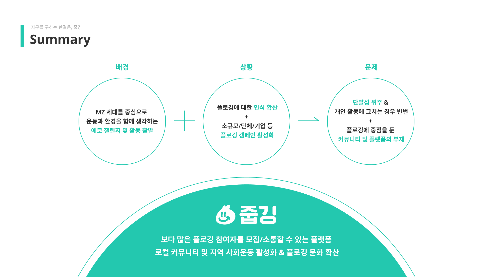

### 🎯Target

------

- 운동과 환경을 동시에 챙기고 싶은 MZ세대 ! 

- 타인과의 만남을 좋아하는 남녀노소 누구나 ! 
- 환경 단체 및 봉사활동 주최자

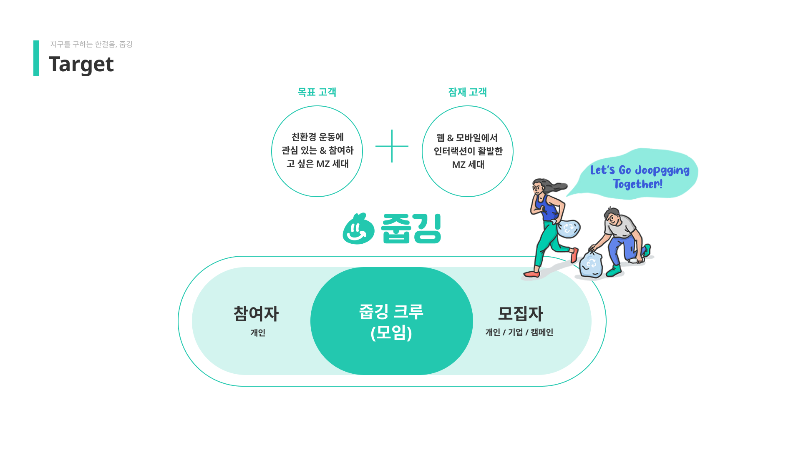

### 💯줍깅 팀 소개

------

#### 👨‍👨‍👦‍👦**[팀원]**

- **Frontend** : 최재환, 김재용, 안정우
- **Backend** : 남우식, 김선겸, 이재성
- **Designer** : 김민지, 한은현

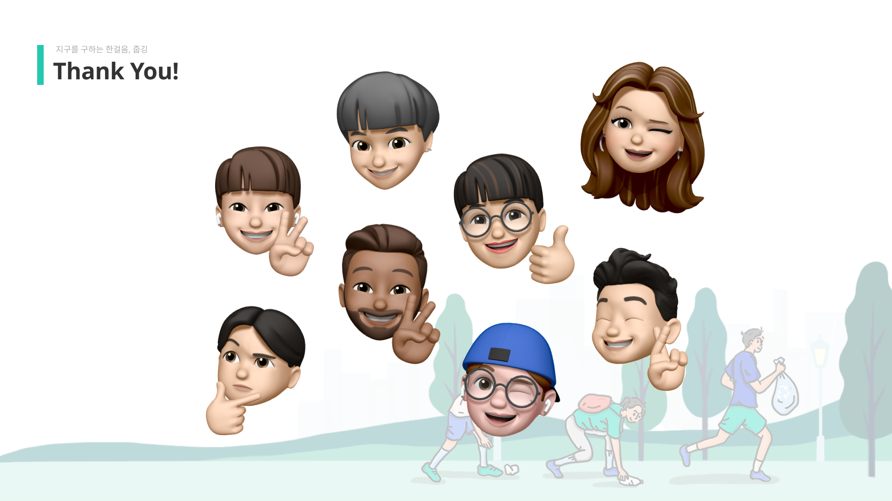

#### 📅**진행 기간**

- 21.10.23 ~ 21.12.05

#### 🎥**발표 영상**

#### 💬커뮤니케이션 툴

- GitHub
- Slack
- Gather

### 💁‍♂️서비스 소개

------

- 회원가입 시 휴대전화 인증 기능

- 메인페이지에서 비로그인시 최신모임, 모집마감임박, 조회수 높은 순으로 조회가능

- 메인페이지에서 로그인한 유저의 성향에 맞는 장소별, 거리별, 지역별 모임 조회 가능

- 모임 상세페이지에서 북마크 하여 언제든지 헤더에서 확인가능

- 모임 상세페이지에서 문의댓글 달기 가능

- 모임 신청 시 마이페이지에서 신청 모임들 확인 가능

- 참여하기 탭에서는 장소별, 거리별, 지역별로 필터를 걸어서 모임 상세 검색 가능

- 모임 확정되면 모임 하루 전 휴대전화로 문자 알림 기능

- 모임 주최자는 모임 당일 휴대전화로 출석체크 링크 전송/ 모임 참여자는 후기 작성 및 설문조사 독려 문자 발송

- 모임이 완료된 후, 후기 작성 가능. 사진과, 후기내용, 별점부여 가능

- 커뮤니티 탭에서 유저들의 모든 후기들을 사진카드 형식으로 확인 가능

- 유저의 행동에 따라 다양한 뱃지 확인 가능. 추후 모임에 참여시 유저의 활동정도를 참고할 수 있음

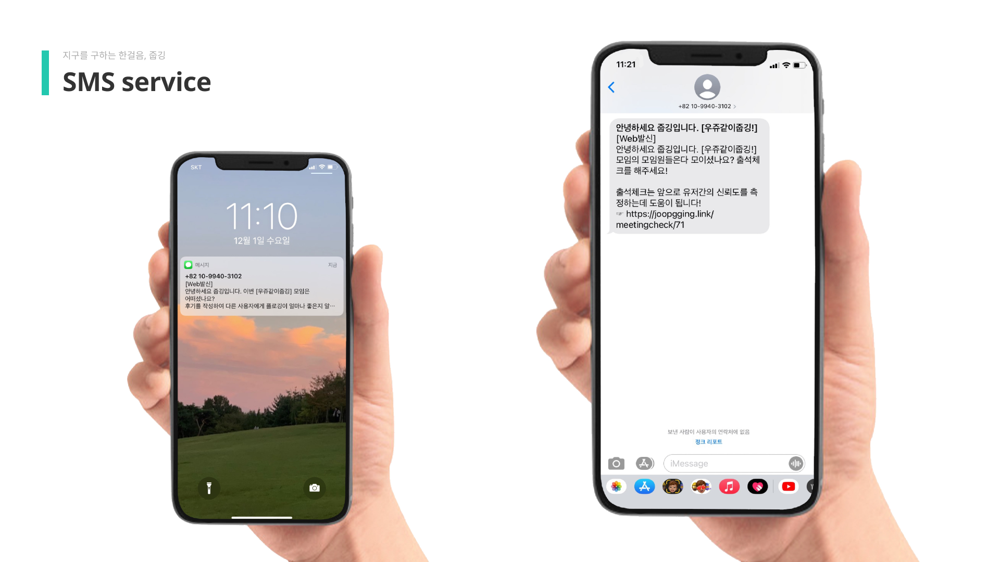

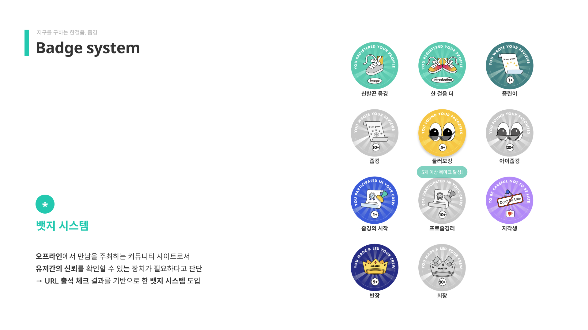

### 🛠️개발환경

------

- **Server**

`AWS EC2(Ununtu 18.04.5 LTS)`
 `Nginx`
 `Jenkins`
 `sentry`
 `ELB(Elastic Load Balancing) - Auto Scaling`

- **DB**

 `Google SQL(MySQL)`

- **SCM**

`Git(GitHub)`

- **BackEnd(Language & Framework & Library)**

Language :  `Java 8` `JDK 1.8.0`

Framework : `Spring Boot 2.5.6`

IDE : `IntelliJ IDEA 2021.1.2`

Build Tools : `Gradle 7.1.1`

ORM : `Spring Data JPA 2.5.3`

Library : `JWT 0.9.1`

​				`Swagger 3.0.0`

​				`Spring Security 5.5.1`

​				`CORS`

Stress Test Tool : `Ngrinder 3.5.5`

### ⛓️아키텍쳐

------

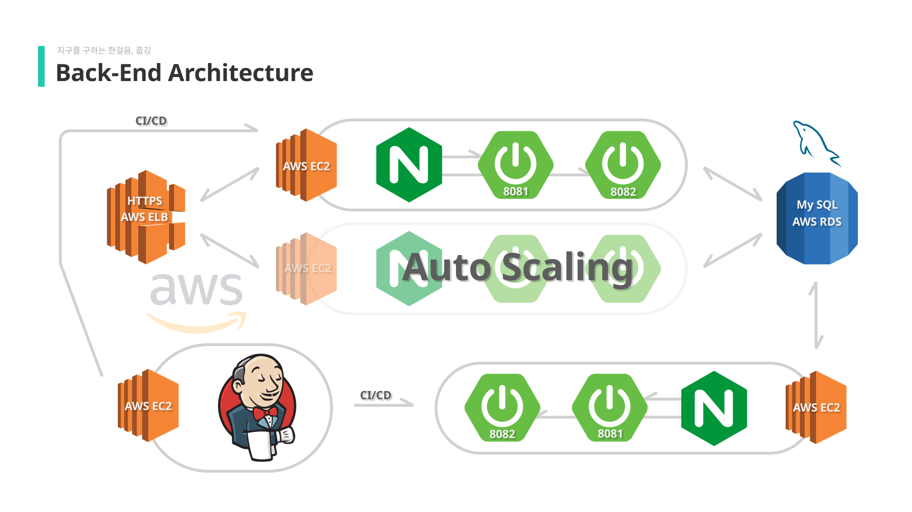

### 🔗ERD

------

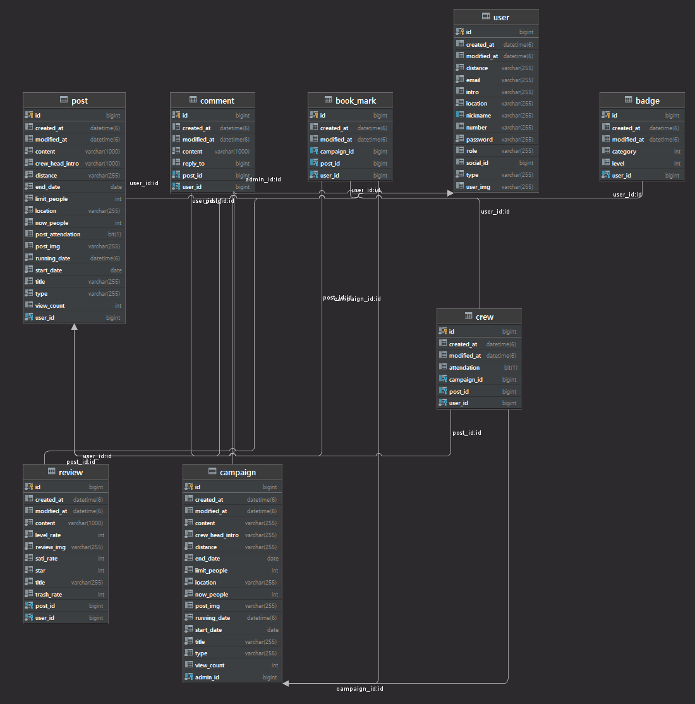

### ⚽트러블 슈팅

------

#### 1. JWT 토큰 인증 예외 처리

- 클라이언트의 요청에 JWT 토큰이 없거나, 오류가 있으면 Filter단계에서 바로 예외를 발생시켜 응답으로 내리고자 하였습니다.

  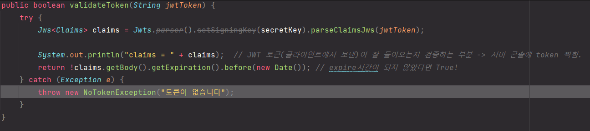

- 하지만 예상과는 다르게 응답이 내려가는 것이 아니라 예외만 발생 -> 스프링 동작 순서에 대해 찾아보았습니다.

  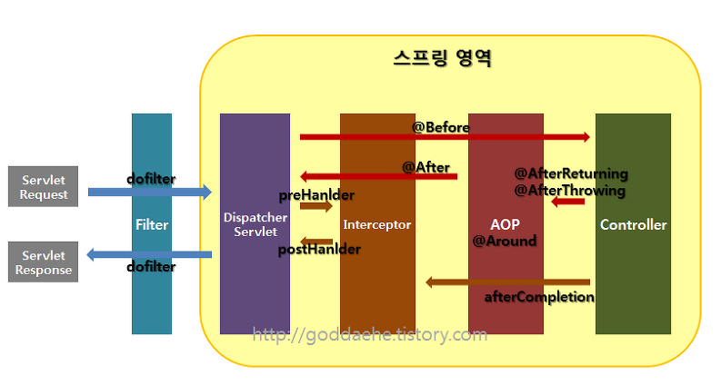

- Filter는 Controller 단계 도달하기 전에 수행되기 때문에 Filter에서 발생시킨 예외가 Controller로 연결되지 못했던 것이였습니다.

✔️**해결**

- Filter에서 발생되는 예외를 Controller로 보내기 위해 Entrypoint를 사용해서 authException을 catch해 예외를 처리해주는 Controller로 보내줘서 응답을 내려주었습니다.

  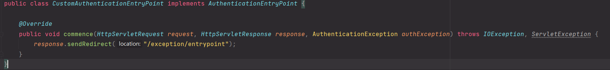

#### 2. 아키텍쳐 스케일 아웃 문제

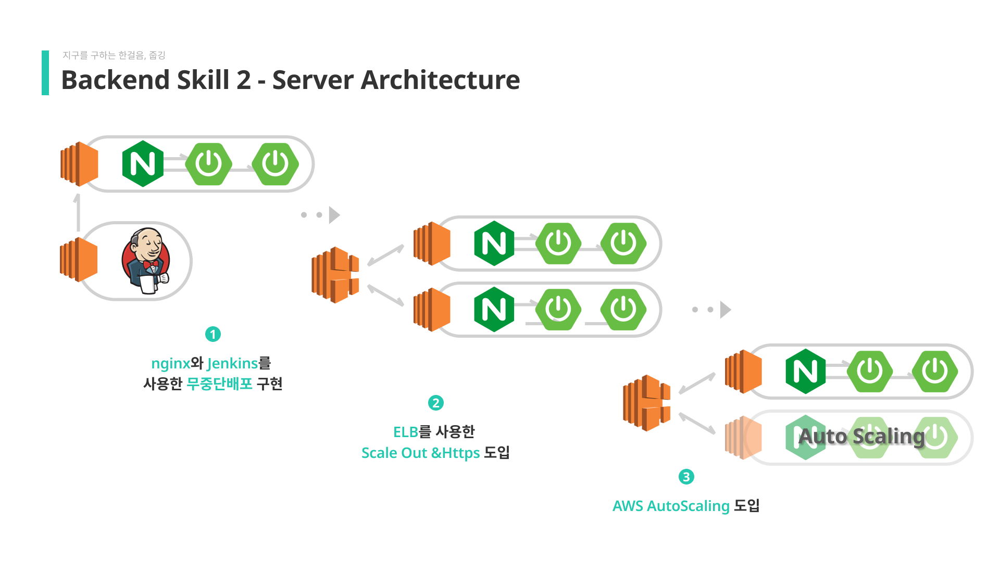

- Ver1. 처음 서버 구축할 때 자동 CI/CD와 무중단 배포가 가능하도록 목표로 삼았습니다. Jenkins를 사용하여 CI/CD를 진행하고 Nginx에 reverse proxy로 서버 포트를 2개로 구동되도록 하였습니다.

- Ver2. Ver.1의 문제점은 서버에 부하가 올 때 스케일아웃이나 스케일업에 대한 고민이 없다는 점이었습니다. 그래서, AWS ELB를 사용하였습니다. ELB를 통해 2대의 서버를 돌리고 라운드로빈 방식으로 부하는 균등하게 분배하였습니다. 이번 개선을 통해서, 스케일 아웃이 가능해졌고, 또한, 서버가 한 대 죽더라고 서비스가 계속 유지될 수 있었습니다. 그리고 SSL 인증서를 받아 Https로도 요청을 받을 수 있게 되었습니다.

✔️**해결**

- Ver3. 하지만, Ver.2에서도 문제를 발견했습니다. Ngrinder로 서버 부하 테스트를 진행하던 중 2대의 서버로도 감당이 어려운 테스트를 진행할 시 즉각적으로 스케일 아웃을 할 수 없었습니다. 기존의 방식에서는 수동으로 서버를 ELB에 추가해주어야 했기 때문입니다. 그래서 AWS Auto Scaling을 사용했습니다. 이를 통해, 서버의 CPU 사용률의 40%를 넘어가면 자동으로 서버를 추가해줘서 즉각 대응이 가능해졌습니다.

### 🚧사용자 피드백 개선

------
사용자 피드백은 회원가입을 하고 기프티콘을 이벤트를 열어 구글폼을 이용해 피드백을 받았습니다. 

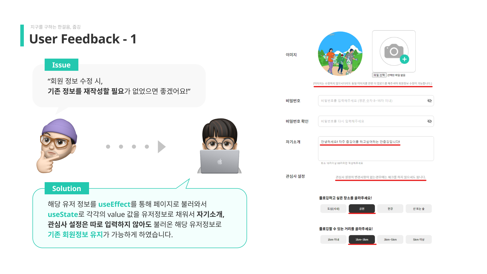

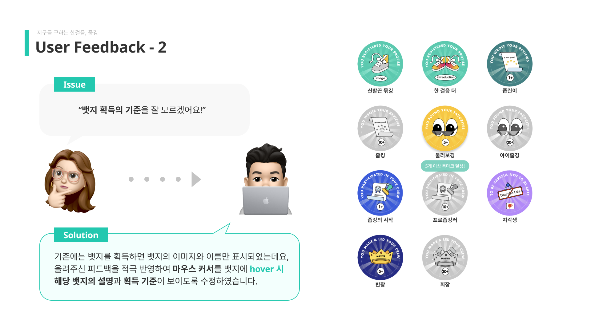

### 📣마케팅 & 분석 

------
마케팅은 분석이 비교적 쉽게 가능한 인스타그램과 구글 아날리틱스를 이용해 진행하였습니다.

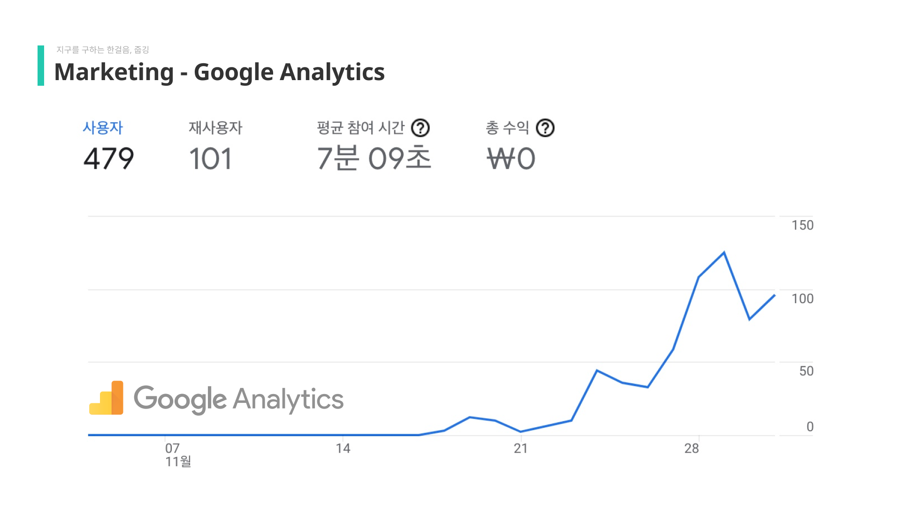

